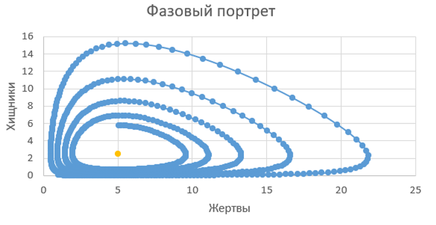
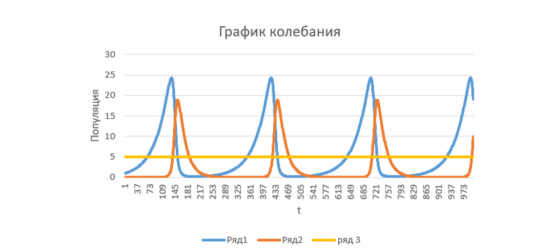
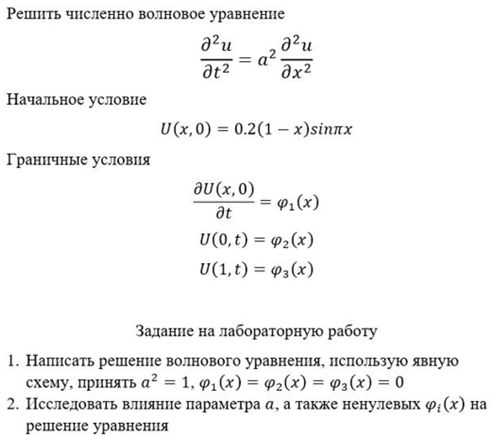
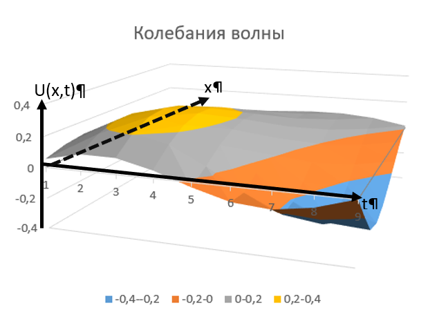
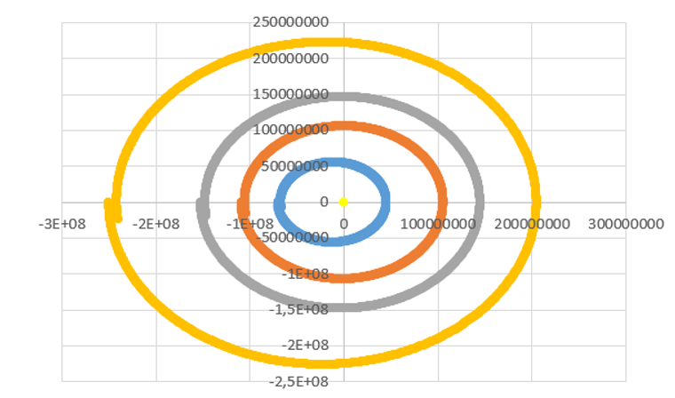

# MathProject
## Оглавление
__1. Математическая модель Лотки-Вольтерры__ 

__2. Решение волнового уравнения__ 

__3. Компьютерное моделирование движения планет солнечной системы__ 

___

___1. Математическая модель Лотки-Вольтерры___

Математическая модель Лотки-Вольтерр («хищник-жертва»)

Задаваемые параметры:
P – количество хищников;
V – количество жертв;
t – время;
a – вероятность рождаемости жертв;
b – вероятность смертности жертв при встрече с хищником;
c – вероятность убыли хищников при нехватке еды;
d – вероятность достаточности еды для размножения хищников
1. Решить систему уравнений численно методом Рунге-Кутты 4 порядка точности;
2. Построить графики изменения динамики численности хищников V(t), и жертв P(t);
3. Построить фазовую диаграмму (по оси Х – жертвы, по оси У – хищники);
4. Найти стационарную точку (равновесное состояние, в общем виде);

___Графики___

Стационарная точка расположенна на графике в виде желтой точки.
___
График колебаний показывает как зависит популяция жертв и хищников от времени.

Ряд-1 — кол-во жертв.
Ряд-2 — кол-во хищников.
Ряд-3 — стационарная прямая.
___

___2. Решение волнового уравнения___

Все данные записываются в файл Lab2.txt.

___График___

показаны 3 оси: U(x,t), x, t.

* Параметр а2 определяет частоту колебаний волны.
* Ненулевые параметры φ3 и φ2 влияют на амплитуду колебаний волны.
* Ненулевой параметр φ1 влияет на смещение колебаний волны в направлении х.
___

___3. Компьютерное моделирование движения планет солнечной системы___

Математическая модель: система уравнений Ньютона (солнце - неподвижно в точке (0,0) или (0,0,0), остальные планеты (достаточно рассмотреть 4-5) удалены от солнца на соответствующие расстояния. Уравнение F=ma записывается для каждой планеты (кроме солнца), в качестве силы рассмотреть гравитационное взаимодействие.

Получить численное решение системы уравнений Ньютона, результатом моделирования должна являться траектория движение планет вокруг солнца.

___Диаграмма___

На диаграмме расположены координаты движения первых 4-х планет солнечной системы. Из-за больших округлений в точке где должны соприкоснуться начало и конец движения планеты расходятся 

